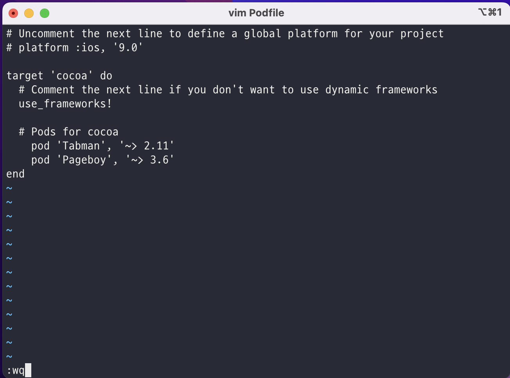

# 설치 방법


## 코코아팟 설치

```swift
sudo gem install cocoapods
```

## 프로젝트 경로로 이동하기

프로젝트 경로로 이동하는 방법은 많다. 그중에 나는 `Finder` 를 이용하는 방법을 사용함.

`Xcode` 키고 → 원하는 project에서 오른쪽 마우스 클릭 or 터치패드 두 손가락으로 클릭 → `show in Finder` → 다시 Finder에서 원하는 project를 선택한 후 오른쪽 마우스 클릭/터치패드 클릭 → `폴더에서 새로운 터미널 열기`  를 누르면 project 경로가 설정된 모습을 볼 수 있다. 

## pod 파일 생성해주기

프로젝트 경로로 이동한 후에는 프로젝트 안에 pod 파일을 생성해 줘야 한다. 이 파일로 Xcode 외부 라이브러리를 `install` 하여 사용할 수 있다.

```swift
pod init 
```

### 주의할 점

<aside>
 빈 프로젝트가 아닌 프로젝트에서 pod init 명령어를 사용해야 한다.

</aside>


## pod파일 열기

pod 파일을 수정해 외부 라이브러리를 install 하는 것이기 때문에 텍스트 편집기를 사용해야 한다. 내가 주로 이용하는 것은 `vim` 이지만 기본 `텍스트 편집기`를 사용하는 것도 편하다. 또한, vscode에서 텍스트 편집도 가능하다는 점.

```swift
vim podfile
```

```swift
open -e podfile
```

## pod 파일 수정

파일 수정은 각 라이브러리마다 다르기 때문에  tabman 을 예로 들어보자 . Podfile의 특정 위치에 설치하고 싶은 라이브러리를 적어주면 된다.

```swift
pod 'Tabman', '~> 2.11'
pod 'Pageboy', '~> 3.6'
```

<p align="center"></p>

### 주의할 점

<aside>
 Tabman은 Pageboy 라이브러리와 같이 사용해야 한다.

</aside>

## pod 파일 설치

```swift
pod install
```

```swift
arch -x86_64 pod install
```

### 주의할 점

<aside>
 설치 후 실행해야 하는 파일은 `xcworkspace` 파일이다

</aside>

<aside>
 m1 mac의 경우 위의 2번째 코드를 사용해야 한다.

</aside>

# 설치 과정에서 오류 발생

Loaderror 발생할 경우에 다음과 같이 하면 된다.

```swift
sudo arch -x86_64 gem install ffi
```

(터미널 키자마자)

```swift
arch -x86_64 pod install
```

(원하는 경로로 이동하여)

---

# 참고자료

[iOS Swift 코코아팟 설치 + 라이브러리 Tabman 사용하기](https://bcoding-lab.tistory.com/119)

[](https://github.com/uias/Tabman](https://github.com/uias/Tabman))
