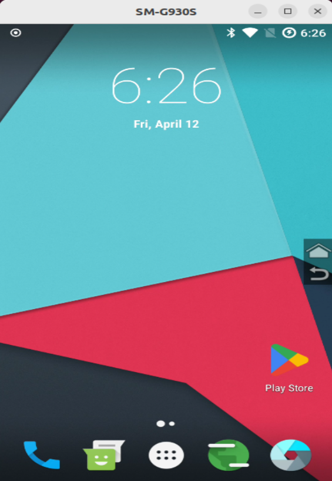

## ☝🏻 발생 에러

```
$ scrcpy
scrcpy 2.4 <https://github.com/Genymobile/scrcpy>
INFO: ADB device found:
INFO:     -->   (usb)  ce0516058123de0e04              device  SM_G930S
/usr/local/share/scrcpy/scrcpy-server: 1 file pushed. 4.5 MB/s (69007 bytes in 0.015s)
[server] INFO: Device: [samsung] samsung SM-G930S (Android 7.1.1)
[server] WARN: Audio disabled: it is not supported before Android 11
INFO: Renderer: opengl
INFO: OpenGL version: 4.3 (Compatibility Profile) Mesa 23.2.1-1ubuntu3.1~22.04.2
INFO: Trilinear filtering enabled
[server] ERROR: Encoding error: java.lang.IllegalStateException: null
[server] INFO: Retrying with -m1920...
[server] INFO: Retrying...
WARN: Demuxer 'audio': stream explicitly disabled by the device
INFO: Texture: 1440x2560--video-codec=h264 --video-encoder='OMX.google.h264.encoder'
[server] ERROR: Encoding error: java.lang.IllegalStateException: null
[server] INFO: Retrying with -m1600...
[server] INFO: Retrying...
[server] INFO: Retrying with -m1280...
[server] INFO: Retrying...
[server] ERROR: Encoding error: java.lang.IllegalStateException: null
[server] ERROR: Encoding error: java.lang.IllegalStateException: null
[server] INFO: Retrying with -m1024...
[server] INFO: Retrying...
[server] ERROR: Encoding error: java.lang.IllegalStateException: null
[server] INFO: Retrying with -m800...
[server] INFO: Retrying...
[server] ERROR: Encoding error: java.lang.IllegalStateException: null
WARN: Device disconnected

```

scrcpy 명령어를 사용했을 때 나타나는 에러들이다. 
Encoding Error로 볼 수 있는데 생각보다 Encoding Error를 다루는 블로그 글이 많지 않아서 정리해본다.

## ☝🏻 해결방법
해결방법은 github issue에서 볼 수 있었다.
https://github.com/Genymobile/scrcpy/issues/4299

이중에서 나는 다음의 방법으로 해결했다.


`[server] WARN: Audio disabled: it is not supported before Android 11` 에러의 경우에는 안드로이드11 이전의 기기에서는 audio를 지원하지 않는 것으로 보인다. 따라서 scrcpy Usage Example에도 나와있듯이 `--no-audio` 옵션을 사용하면 된다.
> 현재 안드로이드 기기는 linearge os version 14 이기 때문에 안드로이드 7이다.


`[server] ERROR: Encoding error: java.lang.IllegalStateException: null` 에러의 경우에는 scrcpy가 인코딩을 하지 못해서 생기는 오류다. 따라서 인코딩 옵션을 따로 줘야한다는 것이 이슈의 핵심이였다. 

다음의 명령어를 사용해서 가능한 인코딩 옵션을 확인해보자. 

```
$ scrcpy --no-audio --list-encoders
```

출력 결과는 다음과 같다.

```
[server] INFO: Device: [samsung] samsung SM-G930S (Android 7.1.1)
[server] INFO: List of video encoders:
    --video-codec=h264 --video-encoder='OMX.Exynos.AVC.Encoder'
    --video-codec=h264 --video-encoder='OMX.google.h264.encoder'
    --video-codec=h265 --video-encoder='OMX.Exynos.HEVC.Encoder'
[server] INFO: List of audio encoders:
    --audio-codec=aac --audio-encoder='OMX.google.aac.encoder'
    --audio-codec=flac --audio-encoder='OMX.google.flac.encoder'
```

따라서 이중 하나의 옵션을 주면 되는데 h264 encoder 가 많이 사용되는 것을 확인하여 2번째 옵션을 주었다.

## ☝🏻 결론
내가 encoding error를 해결한 명령어는 다음과 같다.

```
$ scrcpy --no-audio --video-codec=h264 --video-encoder='OMX.google.h264.encoder'
```


